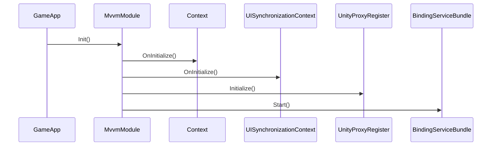
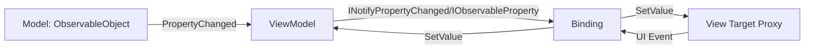
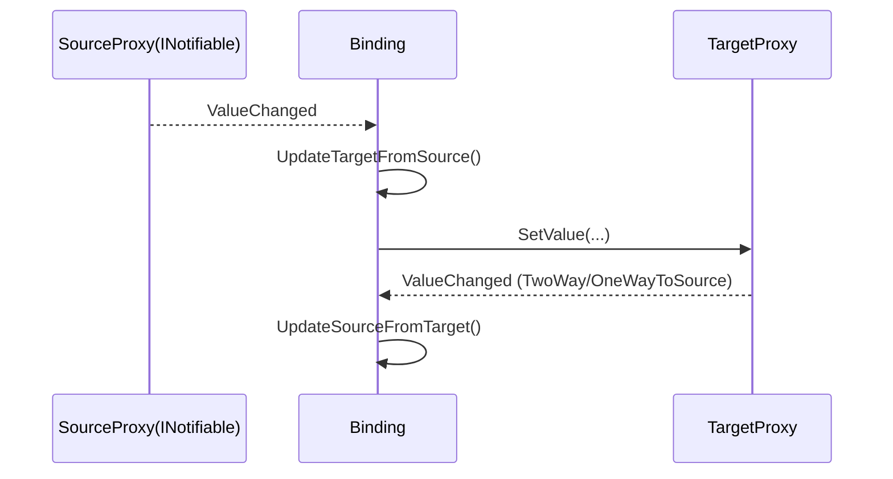

# Project.Framework MVVM 架构设计说明

## 0. 文档范围与入口

本文基于仓库中的实际实现进行说明，范围聚焦于：
- `Assets/GameScripts/HotFix/GameLogic/Module/MvvmModule`
- `Assets/GameScripts/HotFix/GameLogic/Module/UIModule`
- `Assets/GameScripts/HotFix/GameLogic/Demo`（用于落地示例）

该 MVVM 实现不是前端框架式数据劫持，而是 **C# 事件驱动 + 反射代理 + Source/Target Proxy 管线**。

主入口调用链：
1. `GameApp.Entrance()`
2. `MvvmModule.Instance.Init()`
3. `Context.OnInitialize()`
4. `UISynchronizationContext.OnInitialize()`
5. `UnityProxyRegister.Initialize()`
6. `BindingServiceBundle.Start()`

初始化时序图：



---

## 1. 核心职责划分（Model / View / ViewModel）

### 1.1 Model 职责

- 项目没有统一 `IModel` 接口。
- Model 通常继承 `ObservableObject`，负责状态存储与属性变更通知。
- 示例 `BattleModel`：监听领域事件（分数变化、游戏结束），映射为可绑定属性。

关键文件：
- `Assets/GameScripts/HotFix/GameLogic/Module/MvvmModule/Observables/ObservableObject.cs`
- `Assets/GameScripts/HotFix/GameLogic/Demo/Model/BattleModel.cs`

### 1.2 ViewModel 职责

- 契约最小化：`IViewModel : IDisposable`。
- `ViewModelBase` 提供：
  - `Set(...)`：统一属性更新入口（比较旧值、触发通知）
  - `RaisePropertyChanged(...)`：通知绑定系统
  - `Broadcast(...)`：可选发布 `PropertyChangedMessage<T>` 到总线
  - `Dispose(bool)`：释放钩子

关键文件：
- `Assets/GameScripts/HotFix/GameLogic/Module/MvvmModule/ViewModel/IViewModel.cs`
- `Assets/GameScripts/HotFix/GameLogic/Module/MvvmModule/ViewModel/ViewModelBase.cs`
- `Assets/UnityFramework/Runtime/Core/GameEvent/PropertyChangedMessage.cs`

### 1.3 View 职责

- View 载体是 `UIWindow/UIWidget`。
- View 生命周期由 `UIModule` 驱动（`InternalCreate`、`InternalUpdate`、`InternalDestroy`）。
- View 在 `OnCreate()` 中创建 ViewModel 并建立绑定。

关键文件：
- `Assets/GameScripts/HotFix/GameLogic/Module/UIModule/UIWindow.cs`
- `Assets/GameScripts/HotFix/GameLogic/Module/UIModule/UIBase.cs`
- `Assets/GameScripts/HotFix/GameLogic/Module/MvvmModule/Binding/BehaviourBindingExtension.cs`

### 1.4 三层交互契约与数据流



额外职责层：
- Repository/Service 负责数据访问与业务编排，不直接承担 UI 绑定职责。
- 示例：`IBattleRepository`、`IBattleService`。

---

## 2. 双向绑定机制

### 2.1 绑定服务装配

`BindingServiceBundle.OnStart()` 完成绑定引擎装配。

Source 工厂注册优先级：
1. `LiteralSourceProxyFactory`（0）
2. `ExpressionSourceProxyFactory`（1）
3. `ObjectSourceProxyFactory`（2）

Target 工厂注册优先级：
1. `UniversalTargetProxyFactory`（0）
2. `UnityTargetProxyFactory`（10）
3. `VisualElementProxyFactory`（30）

结论：同类能力可通过优先级覆盖实现扩展。

### 2.2 Binding 构建调用链

```text
CreateBindingSet(...)
-> BindingSet.Build()
-> BindingBuilderBase.Build()
-> BindingContext.Add(...)
-> StandardBinder.Bind(...)
-> BindingFactory.Create(...)
-> new Binding(...)
```

核心文件：
- `Binding/Builder/BindingSetBase.cs`
- `Binding/Builder/BindingBuilderBase.cs`
- `Binding/Contexts/BindingContext.cs`
- `Binding/Binders/StandardBinder.cs`
- `Binding/BindingFactory.cs`
- `Binding/Binding.cs`

### 2.3 Source 侧：依赖监听与路径代理

- `ObjectSourceProxyFactory` 根据路径长度创建代理。
- `UniversalNodeProxyFactory` 根据成员类型选具体代理：
  - `PropertyNodeProxy`（`INotifyPropertyChanged`）
  - `ObservableNodeProxy`（`IObservableProperty`）
  - `InteractionNodeProxy`（`IInteractionRequest`）
  - `MethodNodeProxy`、`EventNodeProxy`
- 多段路径使用 `ChainedObjectSourceProxy`，中间节点变化时执行 `Rebind(index)`，保证嵌套路径有效。

### 2.4 Target 侧：回写监听与控件适配

- 基类：`ValueTargetProxyBase`（值类目标）、`EventTargetProxyBase`（事件类目标）。
- UGUI：`UnityPropertyProxy`、`UnityFieldProxy`、`UnityEventProxy`。
- UIElements：`VisualElement*Proxy`、`ValueChangedEventProxy`、`ClickableEventProxy`。
- 通用对象：`PropertyTargetProxy`、`FieldTargetProxy`、`ObservableTargetProxy`、`MethodTargetProxy`、`EventTargetProxy`。

### 2.5 发布-订阅与更新策略

`Binding` 的核心策略：
- 源变更：`UpdateTargetFromSource()`
- 目标变更：`UpdateSourceFromTarget()`
- 循环保护：`isUpdatingSource` / `isUpdatingTarget`
- 首次同步策略由 `BindingMode` 控制：`TwoWay`、`OneWay`、`OneTime`、`OneWayToSource`

双向更新时序：



### 2.6 线程策略

- 若不在 UI 主线程，`Binding` 通过 `UISynchronizationContext.Post` 回主线程执行 UI 更新。
- 命令 `CanExecuteChanged` 导致的控件 `interactable` 更新也走该通道。

### 2.7 命令绑定与参数注入

- UI 事件可绑定 `ICommand`、`Delegate`、`IInvoker`。
- `CommandParameter(...)` 会注入 `ParameterConverter`，包装为 `ParameterCommand` 或参数化 Invoker。
- 用于事件参数透传和命令签名适配。

---

## 3. 生命周期管理

### 3.1 ViewModel 生命周期钩子

| 阶段 | 触发时机 | 建议操作 | 注意事项 |
|---|---|---|---|
| 构造函数 | View 创建 VM | 命令初始化、依赖注入、事件订阅 | 不做重计算与阻塞 IO |
| `Set(...)` | 属性变更 | 保持状态一致并发通知 | 高频属性避免额外分配 |
| `Broadcast(...)` | 需要跨模块消息时 | 发布消息总线事件 | 只在跨域同步场景使用 |
| `Dispose(bool)` | 释放时 | 退订事件、清理引用 | 推荐幂等实现 |
| 析构函数 | GC 兜底 | 最后保护 | 不应依赖析构执行业务释放 |

### 3.2 View 与 BindingContext 生命周期

- `BehaviourBindingExtension.BindingContext()` 会为 `UIWindow` 自动挂载 `BindingContextLifecycle`。
- `BindingContextLifecycle.OnDestroy()` 自动 `Dispose`，触发 `BindingContext.Clear()`。
- `BindingContext.Clear()` 会逐条 `binding.Dispose()`，解除 Source/Target 订阅关系。

### 3.3 推荐的 ViewModel 清理模板

```csharp
public sealed class XxxViewModel : ViewModelBase
{
    private BattleModel _model;

    public XxxViewModel()
    {
        _model = new BattleModel();
        _model.PropertyChanged += OnModelChanged;
        GameEvent.AddEventListener(SomeEventId, OnSomeEvent);
    }

    private void OnModelChanged(object sender, PropertyChangedEventArgs e)
    {
        RaisePropertyChanged(e.PropertyName);
    }

    protected override void Dispose(bool disposing)
    {
        if (!disposing) return;

        if (_model != null)
            _model.PropertyChanged -= OnModelChanged;
        GameEvent.RemoveEventListener(SomeEventId, OnSomeEvent);
    }
}
```

---

## 4. 依赖追踪与响应式系统

### 4.1 响应式对象创建

两类核心响应式来源：
1. `INotifyPropertyChanged`
2. `IObservableProperty`

### 4.2 嵌套属性追踪

`Path -> PathToken -> ChainedObjectSourceProxy`：
- 每段路径映射为一个 node proxy。
- 任一中间节点对象替换后，`Rebind(index)` 重建后续代理链。
- 最终通过 `INotifiable.ValueChanged` 驱动 Binding 更新。

### 4.3 computed 机制（表达式派生）

框架没有独立 `Computed` 类型，但支持表达式派生：
- 通过 `ToExpression(...)` 建立表达式型 Source。
- `ExpressionPathFinder + PathExpressionVisitor` 在构建期提取依赖路径。
- `ExpressionSourceProxy` 订阅所有 inner source 变更，统一触发重算。

依赖图谱：

```mermaid
graph TD
    Expr[Lambda Expression] --> Finder[ExpressionPathFinder]
    Finder --> Visitor[PathExpressionVisitor]
    Visitor --> Paths[Path[]]
    Paths --> Factory[ObjectSourceProxyFactory]
    Factory --> InnerA[SourceProxy A]
    Factory --> InnerB[SourceProxy B]
    InnerA --> ESP[ExpressionSourceProxy]
    InnerB --> ESP
    ESP --> Binding[Binding.UpdateTargetFromSource]
```

### 4.4 watch 机制

- 框架没有 `watch(...)` API，也没有 `Dep/Watcher` 类型。
- 等价能力来自：
  - 绑定层 `INotifiable.ValueChanged`
  - 业务层 `PropertyChanged` / `GameEvent`

结论：依赖图谱是“绑定构建期静态解析 + 运行期事件触发”，不是运行时动态依赖收集。

---

## 5. 组件化与复用

### 5.1 组件注册机制

- Source/Target 工厂都在 `BindingServiceBundle` 集中注册。
- Unity 内置控件属性映射由 `UnityProxyRegister.Initialize()` 批量注册，降低业务层绑定样板代码。

### 5.2 props 传递机制

当前实现的“props 等价能力”：
1. `DataContext`（View -> ViewModel 主输入）
2. `CommandParameter(...)`（事件参数输入）

### 5.3 事件派发机制

- UI -> VM：`UnityEventProxy`、`ValueChangedEventProxy`、`ClickableEventProxy`
- 请求交互：`IInteractionRequest`（源）到 `IInteractionAction`（目标）
- 跨模块：`GameEvent.Publish/Send`

### 5.4 插槽（slot）分发机制

没有 Vue 式 slot 协议。实际采用 UI 组合分发：
- `CreateWidgetByPath`
- `CreateWidgetByPrefab`
- `CreateWidgetByType`

由父节点 Transform 决定挂载位。

---

## 6. 扩展指南（继续整理）

### 6.1 扩展 Source 侧

步骤：
1. 实现 `INodeProxyFactory`。
2. 返回自定义 `ISourceProxy`。
3. 在 `ObjectSourceProxyFactory.Register(factory, priority)` 注册。

### 6.2 扩展 Target 侧

步骤：
1. 实现 `ITargetProxyFactory`。
2. 在 `BindingServiceBundle.OnStart` 注册。
3. 值类目标继承 `ValueTargetProxyBase`，事件类目标继承 `EventTargetProxyBase`。

### 6.3 扩展 Converter

步骤：
1. 实现 `IConverter`。
2. 在绑定声明中 `WithConversion(...)` 使用。
3. 事件参数转换可复用 `ParameterConverter` 设计。

---

## 7. 已识别限制与改进建议

1. `watch/computed` 非一等 API。建议补充统一 Watch 层，封装订阅与退订生命周期。
2. `BindingBuilderBase.SetMemberPath(string)` 与 `SetStaticMemberPath(string)` 标注“暂时关闭”，字符串路径 API 不可作为主路径方案。
3. VM 资源释放依赖开发者覆写 `Dispose(bool)`。建议引入团队模板约束事件退订。
4. 深层路径绑定会放大反射与事件链成本。建议关键 UI 使用浅层路径与局部 VM。
5. 需持续检查跨线程 UI 更新路径，确保所有 UI 写入都通过主线程上下文。

---

## 8. 排障清单

1. 先看 `Binding` 日志：区分 `UpdateTarget` 与 `UpdateSource` 方向失败。
2. 检查 `DataContext` 是否为空（可能退化到 `EmptSourceProxy`）。
3. 检查 `TargetName`、`UpdateTrigger` 是否存在且类型匹配。
4. 检查命令参数类型与 `ICommand<T>` 泛型签名是否兼容。
5. 检查窗口关闭后是否仍响应外部事件，判断是否存在退订遗漏。

---

## 9. Demo 闭环映射

- View：`BattleWindow` 在 `OnCreate()` 建立 `BindingSet`。
- ViewModel：`BattleViewModel` 组合命令与 Model，并对外抛出可绑定属性。
- Model：`BattleModel` 响应领域事件并转化为属性变化。

对应文件：
- `Assets/GameScripts/HotFix/GameLogic/Demo/Views/BattleWindow.cs`
- `Assets/GameScripts/HotFix/GameLogic/Demo/ViewModels/BattleViewModel.cs`
- `Assets/GameScripts/HotFix/GameLogic/Demo/Model/BattleModel.cs`

---

## 10. 关键源码索引（含调用链）

### 10.1 启动入口到绑定引擎

1. `GameApp.Entrance` -> `StartGameLogic`  
   `Assets/GameScripts/HotFix/GameLogic/GameApp.cs:29,43-47`
2. `MvvmModule.Init` 初始化上下文、线程同步、代理注册、绑定服务  
   `Assets/GameScripts/HotFix/GameLogic/Module/MvvmModule/MvvmModule.cs:13-21`
3. `BindingServiceBundle.OnStart` 注册 Source/Target 工厂与 Binder/Factory  
   `Assets/GameScripts/HotFix/GameLogic/Module/MvvmModule/Binding/BindingServiceBundle.cs:23-62`

### 10.2 绑定构建链（Build Path）

1. View 建立绑定：`BattleWindow.OnCreate` + `bindingSet.Build()`  
   `Assets/GameScripts/HotFix/GameLogic/Demo/Views/BattleWindow.cs:27-43`
2. `BindingSetBase.Build` 循环执行每个 builder  
   `Assets/GameScripts/HotFix/GameLogic/Module/MvvmModule/Binding/Builder/BindingSetBase.cs:18-33`
3. `BindingBuilderBase.Build` -> `BindingContext.Add`  
   `Assets/GameScripts/HotFix/GameLogic/Module/MvvmModule/Binding/Builder/BindingBuilderBase.cs:193-203`  
   `Assets/GameScripts/HotFix/GameLogic/Module/MvvmModule/Binding/Contexts/BindingContext.cs:168-172`
4. `StandardBinder.Bind` -> `BindingFactory.Create` -> `new Binding(...)`  
   `Assets/GameScripts/HotFix/GameLogic/Module/MvvmModule/Binding/Binders/StandardBinder.cs:16-19`  
   `Assets/GameScripts/HotFix/GameLogic/Module/MvvmModule/Binding/BindingFactory.cs:29-31`

### 10.3 双向更新链（Run Path）

1. `BindingContext.DataContext` setter 广播上下文变化  
   `Assets/GameScripts/HotFix/GameLogic/Module/MvvmModule/Binding/Contexts/BindingContext.cs:84-95`
2. `Binding.OnDataContextChanged` 创建 SourceProxy 并首帧同步  
   `Assets/GameScripts/HotFix/GameLogic/Module/MvvmModule/Binding/Binding.cs:63-70,91-103`
3. 订阅链：Source `ValueChanged` -> `UpdateTargetFromSource`；Target `ValueChanged` -> `UpdateSourceFromTarget`  
   `Assets/GameScripts/HotFix/GameLogic/Module/MvvmModule/Binding/Binding.cs:120,152,176,371`
4. 非主线程 UI 更新通过 `UISynchronizationContext.Post` 回主线程  
   `Assets/GameScripts/HotFix/GameLogic/Module/MvvmModule/Binding/Binding.cs:176-193`

### 10.4 依赖追踪与表达式链

1. `ExpressionPathFinder.FindPaths` 入口  
   `Assets/GameScripts/HotFix/GameLogic/Module/MvvmModule/Binding/Paths/ExpressionPathFinder.cs:10-15`
2. `PathExpressionVisitor` 解析 `Member/MethodCall/ArrayIndex` 等表达式节点  
   `Assets/GameScripts/HotFix/GameLogic/Module/MvvmModule/Binding/Paths/PathExpressionVisitor.cs:21-83,149-179`
3. `ExpressionSourceProxyFactory.TryCreateProxy` 生成 inner source 列表并编译表达式  
   `Assets/GameScripts/HotFix/GameLogic/Module/MvvmModule/Binding/Proxy/Sources/Expressions/ExpressionSourceProxyFactory.cs:21-79`
4. `ExpressionSourceProxy` 订阅 inner `ValueChanged` 并统一 `RaiseValueChanged`  
   `Assets/GameScripts/HotFix/GameLogic/Module/MvvmModule/Binding/Proxy/Sources/Expressions/ExpressionSourceProxy.cs:30-34,52-55`
5. `ChainedObjectSourceProxy.Rebind` 处理中间节点替换  
   `Assets/GameScripts/HotFix/GameLogic/Module/MvvmModule/Binding/Proxy/Sources/Object/ChainedObjectSourceProxy.cs:134-145,168-198`

### 10.5 生命周期与销毁链

1. UI 生命周期：`InternalCreate` / `InternalUpdate` / `InternalDestroy`  
   `Assets/GameScripts/HotFix/GameLogic/Module/UIModule/UIWindow.cs:271-281,288-357,359-388`
2. `BindingContextLifecycle.OnDestroy` 自动回收 `BindingContext`  
   `Assets/GameScripts/HotFix/GameLogic/Module/MvvmModule/Binding/Contexts/BindingContextLifecycle.cs:24-30`
3. `BindingContext.Dispose` -> `Clear` -> `binding.Dispose`  
   `Assets/GameScripts/HotFix/GameLogic/Module/MvvmModule/Binding/Contexts/BindingContext.cs:199-214,221-245`
4. VM 释放入口：`ViewModelBase.Dispose(bool)`（带终结器兜底）  
   `Assets/GameScripts/HotFix/GameLogic/Module/MvvmModule/ViewModel/ViewModelBase.cs:72-77`

---

## 11. 下一步整理建议（工程落地优先级）

1. 补充统一 `WatchHandle` 封装（基于 `PropertyChanged`/`ValueChanged`），减少手写订阅与泄漏风险。  
2. 增加“绑定性能观测点”：统计每帧 Binding 更新次数、主线程回投次数、深层路径 Rebind 频次。  
3. 在 ViewModel 模板中强制提供 `Dispose(bool)` 退订清单（事件、计时器、异步取消令牌）。  
4. 约束复杂 UI 的绑定层级（优先浅路径 + 局部 VM），避免深链反射代理放大开销。  
5. 建立“Service/Repository 与 MVVM 边界”检查项：Repository 不引用 UI，View 不直连 Repository。
